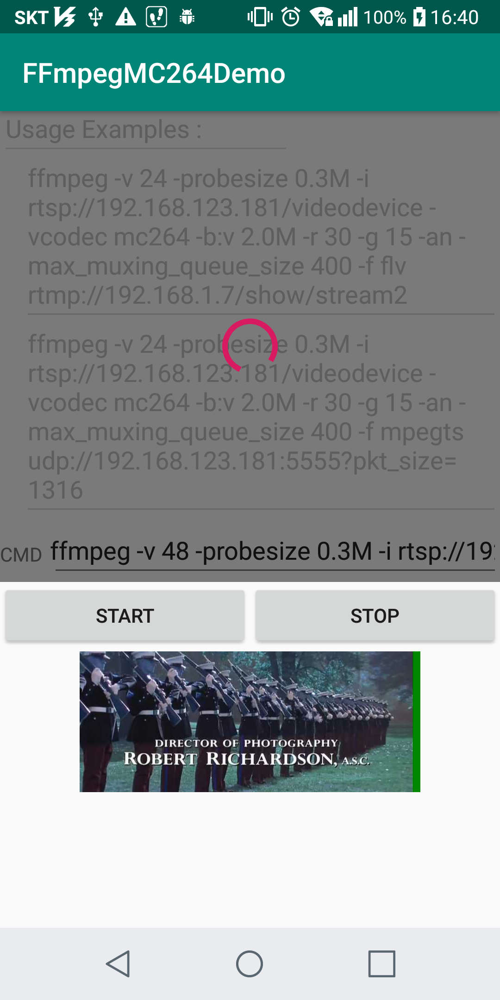

FFmpegMC264Demo
===============

FFmpegMC264 is a ffmpeg android library powered by MediaCodec HW accelated encoder.  
Now use 'mc264' instead of 'libx264' in runing ffmpeg command in your code.

FFmpegMC264 library doesn't call ffmpeg executable file through exec().
Instead this library has embedded the ffmpeg as an API function.
So, you can call the ffmpeg like this : 
* int retcode = mMC264Encoder.ffmpegRun(cmdString);
  - cmdString example : 
  - ffmpeg -i INPUT -vcodec mc264 -b:v 2.0M -r 30 -g 15 -acodec copy -f mp4 OUTPUT
  
For this, in C side, an encoder module - mc264.c - was added into ffmpeg libavcodec. 
In java side, an encoder controller class - MC264Encoder.java - was added over android MediaCodec (H.264 encoder only).

Enjoy ffmpeg powered by MediaCodec HW accelated encoder.

## Supported Color Format :
* ffmpeg INPUT stream : yuv420p
* MediaCodec : YV12 [NV12] (MediaCodecInfo.CodecCapabilities.COLOR_FormatYUV420SemiPlanar)

The INPUT stream should have the color format YUV420Planar. 
The MediaCodec should have the color format YV12 [NV12].

## Screenshot

  

## Referenced Links :
* Handling H.264 SPS / PPS 
  - https://github.com/Kickflip/kickflip-android-sdk/blob/master/sdk/src/main/java/io/kickflip/sdk/av/FFmpegMuxer.java
* https://stackoverflow.com/questions/24884827/possible-locations-for-sequence-picture-parameter-sets-for-h-264-stream/24890903#24890903
* https://stackoverflow.com/questions/20909252/calculate-pts-before-frame-encoding-in-ffmpeg
* http://leo.ugr.es/elvira/devel/Tutorial/Java/native1.1/implementing/index.html
* Color Format :
  - https://software.intel.com/en-us/ipp-dev-reference-pixel-and-planar-image-formats#FIG6-15
  - https://developer.android.com/reference/android/graphics/ImageFormat.html#YV12
  - https://en.wikipedia.org/wiki/YUV
* VideoKit :
  - https://github.com/inFullMobile/videokit-ffmpeg-android
  - https://github.com/IljaKosynkin/FFmpeg-Development-Kit
* Cross Compiling FFmpeg 4.0 for Android
  - https://medium.com/@karthikcodes1999/cross-compiling-ffmpeg-4-0-for-android-b988326f16f2

